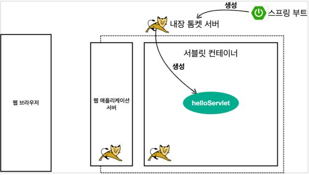
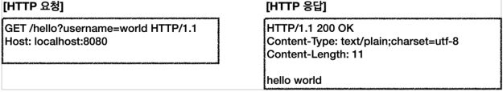
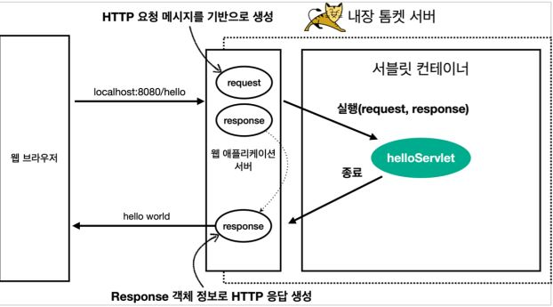

# Hello 서블릿


## 서블릿 등록하기

> ※ 스프링 부트는 톰캣 서버를 내장하고 있음(톰캣 설치 없이 서블릿 코드 생성 가능!)

- @ServletComponentScan
  	    - 서블릿을 직접 등록해서 사용 가능

```java
@ServletComponentScan //서블릿 자동 등록
@SpringBootApplication
public class ServletApplication {
public static void main(String[] args) {
SpringApplication.run(ServletApplication.class, args);
}
```

---


- 서블릿 코드 등록

  ```java
  @WebServlet(name = "helloServlet", urlPatterns = "/hello")
  public class HelloServlet extends HttpServlet {
  
      @Override
      protected void service(HttpServletRequest request, HttpServletResponse response) throws ServletException, IOException {
  
          response.setContentType("text/plain");
          response.setCharacterEncoding("utf-8");
          response.getWriter().write("hello " + username);
      }
  }
  ```

- @WebServlet 서블릿 애노테이션
  - name : 서블릿 이름
  - urlPatterns : URL 매핑

---


## 서블릿 컨테이너 동작 방식

1.내장 톰켓 서버 생성



2.HTTP 요청, 응답 메시지



3.웹 애플리케이션 서버의 요청 응답 구조



